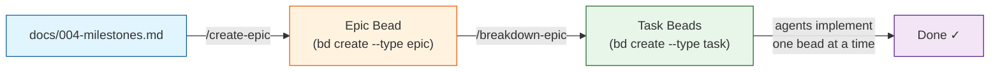
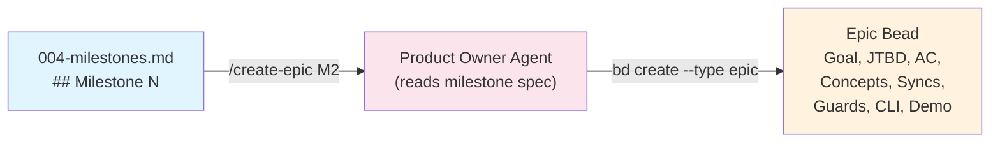
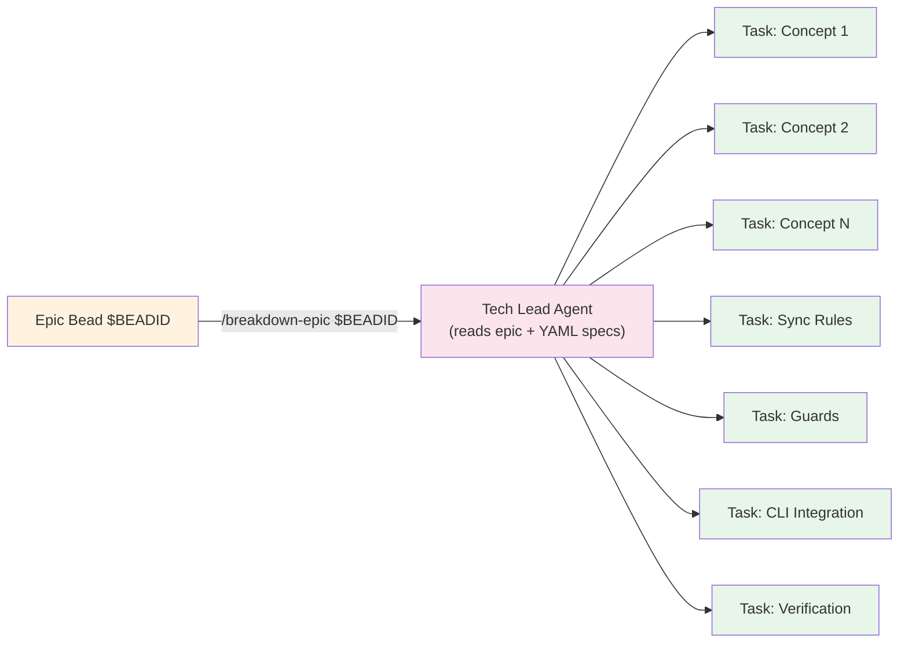
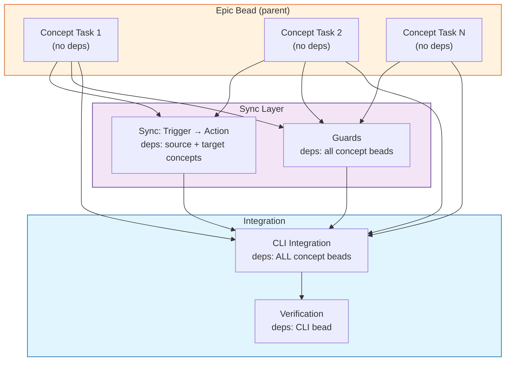

# AlphaTrace Development Workflow

This document describes the three-phase pipeline used to go from milestone specifications to actionable AI-agent tasks. The workflow enforces **Concept Design + WYSIWID** patterns by using Bead issue tracking as the coordination layer.

```
Milestones (written)  →  Epic Bead (bd)  →  Task Beads (bd)  →  Implementation
```

---

## Pipeline Overview



---

## Phase 1: Milestones (Human)

**Input:** Product vision, concept YAML specs, sync YAML specs
**Output:** `docs/004-milestones.md`

A human architect writes milestone definitions in `docs/004-milestones.md`. Each milestone is a **vertical slice** of user-facing functionality:

| Section | Purpose |
|---------|---------|
| **Goal** | One-line summary of what the milestone delivers |
| **Jobs-to-be-Done** | Full JTBD format: situation → motivation → expected outcome |
| **Acceptance Criteria** | Testable checkboxes that define "done" |
| **Concepts** | Which concept YAML specs must be implemented |
| **Sync Rules** | Which sync YAML specs must be implemented |
| **Guards** | Cross-concept rules enforced at the sync layer |
| **CLI Commands** | User-facing interface for the milestone |
| **Demo Script** | End-to-end verification steps |

Milestones are ordered (`M0`–`M6`) and each builds on the previous one. See the [dependency graph](004-milestones.md#dependencies-between-milestones).

---

## Phase 2: Create Epic (Product Owner Agent)

**Command:** `/create-epic`

**Input:** A milestone section from `docs/004-milestones.md`
**Output:** A single `bd` Epic Bead



### What the agent does

1. **Validates** the milestone number exists in `docs/004-milestones.md`
2. **Checks** for duplicate Epic beads (same milestone already tracked)
3. **Extracts** all fields: Goal, JTBD, Acceptance Criteria, Concepts table, Sync Rules table, Guards, CLI Commands, Demo Script
4. **Creates** an Epic bead with structured description via `bd create --type epic`
5. **Outputs** the bead ID for chaining into `/breakdown-epic`

### Labels applied

| Label | Value |
|-------|-------|
| `type` | `epic` |
| `milestone` | `M0`–`M6` |

### Priority mapping

| Milestone | Priority |
|-----------|----------|
| M0 | P3 (infrastructure) |
| M1–M2 | P2 (core features) |
| M3–M4 | P1 (important features) |
| M5–M6 | P0 (critical completion) |

---

## Phase 3: Breakdown Epic (Tech Lead Agent)

**Command:** `/breakdown-epic <BEAD_ID>`

**Input:** An Epic Bead ID
**Output:** 5–15 ordered Task Beads with dependency chains



### Bead creation order and dependencies

Beads are created in a strict order so each can reference the previous ones as dependencies:



### What each task bead contains

| Bead Type | Description Section | Acceptance Criteria |
|-----------|-------------------|-------------------|
| **Concept** | Inlines the full YAML spec (state fields, actions, operational principle) | All state fields + actions implemented; unit tests; `ruff` + `ty` pass; no cross-concept imports |
| **Sync Rule** | YAML spec inline; trigger → action mapping with bead IDs | Registered with engine; fires under correct conditions; compensating action works; tests pass |
| **Guards** | All guard conditions from the epic | Each guard enforces before protected action; clear error messages; tests pass |
| **CLI Integration** | CLI commands code block from epic | All commands parse args, call correct actions, display results, handle errors |
| **Verification** | Demo script code block from epic | All demo steps succeed when executed in order |

### Edge cases handled

| Condition | Behavior |
|-----------|----------|
| Concepts table says "None" | Skip concept beads; create infrastructure beads instead (e.g., M0) |
| Sync Rules says "None" | Skip sync beads |
| Guards says "None" | Skip guards bead |
| YAML spec file missing | Warn but still create bead with work scope from epic context |

---

## Full Workflow Walkthrough

Here is how the three phases chain together end-to-end:

```
 # Phase 1: Milestones exist in docs/004-milestones.md (written by human)
 #
 # Phase 2: Create an Epic from a milestone
 /create-epic M2
 # → Product Owner agent reads docs/004-milestones.md
 # → Finds ## Milestone 2: Calculate What a Company is Worth
 # → Creates Epic bead: "Epic: Milestone 2 — Calculate What a Company is Worth"
 # → Prints: Created bead BD-EPIC-042

 # Phase 3: Break down the Epic into tasks
 /breakdown-epic BD-EPIC-042
 # → Tech Lead agent reads the Epic, reads YAML specs
 # → Creates task beads with dependencies:
 #   1. Implement IntrinsicValue (no deps) → BD-TASK-100
 #   2. Implement MarginOfSafety (no deps) → BD-TASK-101
 #   3. Implement Alert (no deps) → BD-TASK-102
 #   4. Sync: FinancialMetrics.update → IntrinsicValue.recalculate (deps: 100) → BD-TASK-103
 #   5. Sync: IntrinsicValue.recalculate → MarginOfSafety.recalculate (deps: 100,101) → BD-TASK-104
 #   6. Sync: MarketData.update → check alerts (deps: 102) → BD-TASK-105
 #   7. CLI Integration (deps: 100,101,102) → BD-TASK-106
 #   8. Verification (deps: 106) → BD-TASK-107
 #
 # Then agents implement beads in order:
 bd children BD-EPIC-042 --pretty   # Shows: BD-TASK-100, 101, 102, 103, 104, 105, 106, 107
 # Start with: bd show BD-TASK-100
```

---

## Agent Persona Mapping

| Command | Agent Persona | Responsibility |
|---------|---------------|----------------|
| `/create-epic` | **Product Owner** | Translate milestone spec → structured Epic bead with all fields preserved |
| `/breakdown-epic` | **Tech Lead** | Decompose Epic into ordered Task beads; enforce Concept Design rules; set dependencies |

Implementation agents (not defined in these commands) work through the resulting Task beads one at a time, respecting the dependency order.

---

## Command Reference

| Command | File | Purpose |
|---------|------|---------|
| `/create-epic` | [`.opencode/commands/create-epic.md`](../.opencode/commands/create-epic.md) | Create an Epic bead from a milestone section |
| `/breakdown-epic` | [`.opencode/commands/breakdown-epic.md`](../.opencode/commands/breakdown-epic.md) | Break down an Epic bead into ordered Task beads |
| `bd` (beads) | — | Issue tracker for tracking epics, tasks, and dependencies |

---

## Design Rules Enforced

These rules from `AGENTS.md` are enforced **by the workflow** — the commands prevent violations:

1. **Concepts are islands** — Task beads per concept must not import other concepts
2. **Cross-concept references are opaque IDs** — Sync beads use `thing_id: UUID`, not objects
3. **Syncs live in `syncs/`, not concepts** — Sync beads register with the engine, not inside concept actions
4. **Actions return ActionRecords** — Concept beads must emit typed records (needed for sync triggers)
5. **Guards are sync-layer concerns** — Guard beads register with the engine, not inside concepts
6. **View Concepts are read-only** — No mutating actions on view concepts
